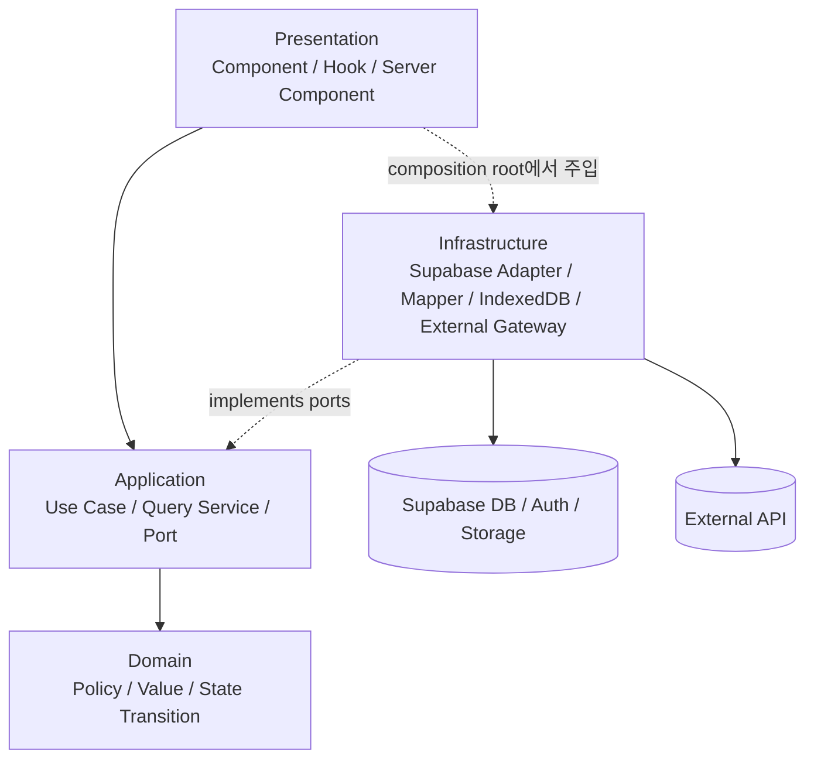

# DDD-lite 데이터 접근 아키텍처 및 전환 로드맵

> 상태: 전환 진행 중
>
> 기준일: 2026-08-26
>
> 적용 범위: Kkuko Utils의 Supabase 데이터 접근, 인증, DB mutation, 조회 상태 관리

## 1. 문서 목적

이 문서는 Kkuko Utils의 데이터 접근 코드를 전역 `SCM` 중심 구조에서 기능별 DDD-lite 구조로 점진적으로 전환하기 위한 기준 문서다. 다음 질문에 답하는 것을 목적으로 한다.

- 현재 구조의 가장 큰 문제는 무엇인가?
- 이미 개선된 범위와 아직 이전하지 않은 범위는 어디인가?
- 최종적으로 어떤 계층과 의존성 방향을 지향하는가?
- 브라우저, Next.js 서버, Supabase Data API, Database RPC 중 무엇을 언제 사용하는가?
- 원자성, 긴 실행 시간, 재시도, 권한 검증은 어느 계층이 책임지는가?
- 어떤 기능부터 어떤 단위로 이전해야 하는가?
- 언제 한 기능의 이전이 끝났다고 판단하는가?

이 문서는 장기적인 방향과 작업 우선순위를 다루는 살아 있는 문서다. 첫 번째 전환 대상이었던 관리자 단어 대량 승인 흐름의 상세 설계와 구현 순서는 다음 문서를 참고한다.

- [DDD-lite 데이터 접근 리팩터링 상세 설계](../superpowers/specs/2026-08-20-ddd-lite-data-access-refactoring-design.md)
- [재개 가능한 단어 승인 배치 구현 계획](../superpowers/plans/2026-08-20-resumable-word-approval-batch.md)
- [단어 승인 RPC 통합 테스트](../testing/word-approval-rpc-integration.md)
- [단어 삭제 RPC 통합 테스트](../testing/word-deletion-rpc-integration.md)
- [관리자 docs 요청 moderation RPC 통합 테스트](../testing/docs-request-moderation-rpc-integration.md)
- [단어 삭제 RPC 클라우드 반영 절차](../deployment/word-deletion-rpc-cloud-rollout.md)
- [사용자 단어 주제 변경 요청 RPC 통합 테스트](../testing/user-word-theme-request-rpc-integration.md)
- [사용자 단어 추가 요청 RPC 통합 테스트](../testing/user-word-addition-request-rpc-integration.md)
- [사용자 단어 대량 추가 요청 RPC 통합 테스트](../testing/user-word-addition-batch-rpc-integration.md)

## 2. 요약

현재 구조의 핵심 문제는 Supabase 자체가 아니라, UI와 업무 규칙이 Supabase의 테이블·응답 타입·호출 순서에 직접 결합되어 있다는 점이다. 전역 `SCM`은 이 결합을 감추는 facade 역할은 하지만, 기능 경계를 만들지는 못한다. 그 결과 복합 변경의 원자성, 청크 크기, 오류 처리, 캐시, 실행 환경이 컴포넌트와 거대한 매니저에 분산되어 있다.

지향하는 구조는 다음과 같다.

- 코드는 CRUD 종류가 아니라 업무 기능별 세로 슬라이스로 나눈다.
- Domain과 Application은 Supabase, React, Next.js, 생성된 DB 타입을 모른다.
- UI는 use case 또는 feature hook만 호출한다.
- Infrastructure adapter만 Supabase SDK, DB Row, RPC 이름을 안다.
- 단순 조회는 RLS로 보호된 Supabase Data API를 브라우저 또는 서버 adapter가 직접 사용할 수 있다.
- 여러 테이블을 함께 바꾸는 mutation은 하나의 Database RPC transaction으로 처리한다.
- 큰 작업은 작은 원자적 배치로 나누고, 전체 operation은 멱등적으로 재개할 수 있게 한다.
- Next.js Route Handler는 모든 DB 요청의 의무적인 중간 계층이 아니다. 서버 secret 또는 서버 전용 통합이 필요한 경우에만 사용한다.
- 기존 `SCM`은 한 번에 제거하지 않고, 위험도가 높은 기능부터 strangler 방식으로 축소한다.

관리자 단어 대량 승인·삭제, 요청 moderation, 사용자 단어 요청, `word-catalog` 조회와 주요 docs 경계가 위 원칙으로 이전되었다. `WordAddHome.tsx`의 일반 사용자 요청뿐 아니라 관리자·`r4` 직접 추가도 feature hook과 원자적 RPC를 사용한다. 직접 추가 RPC는 actor/role을 DB에서 결정하고 단어·주제 관계·단어 로그·중복 없는 docs 로그·최근 수정 효과를 한 transaction으로 처리하며, behavior/concurrency pgTAP으로 검증되었다. Auth session 복원·상태 구독·Google 로그인·로그아웃은 작은 identity gateway로, 현재 사용자 공개 프로필 조회는 별도 query 계약으로 분리되었다. 신규 사용자 nickname 확인·등록도 nickname-only Application command와 분리된 query/command gateway로 이전되었고, 최종 중복 판정은 기존 unique constraint가 담당한다. Phase 0B의 47개 의미 reference와 disposable local DB 검증도 완료되었다. 관련 cloud Supabase migration은 사용자/운영자가 통제하는 rollout 대기 상태이며, 아직 검사하지 않은 다음 경계를 추측하지 않는다.

## 3. 현재 상태

### 3.1 정량적 스냅샷

2026-08-22 저장소 기준으로 확인한 수치는 다음과 같다.

| 항목 | 현재 값 | 의미 |
| --- | ---: | --- |
| `SCM`을 직접 import하는 소스 파일 | 42개 | UI, hook, Route Handler와 관련 테스트가 여전히 전역 manager를 사용함 |
| `SCM.*` 호출 라인 | 140개 | 조회와 legacy 사용자 mutation orchestration이 넓게 분산됨 |
| `SupabaseClientManager.ts` | 928줄 | 조회, 변경, Auth, Storage, 캐시가 한 구현에 집중됨 |
| `ISupabaseClientManager.ts` | 134줄 | Supabase 응답 타입을 노출하는 넓은 인터페이스 |
| DDD-lite로 이전된 기능 흐름 | 5개 | 대량 승인·재개 가능한 대량 삭제·요청 단어 개별 승인/반려·docs 내부 관리자 moderation·docs 사용자 단어 요청 흐름 |

이 수치는 작업 진행도를 관찰하기 위한 기준선이지 목표 자체는 아니다. 호출 수를 줄이기 위해 무의미한 wrapper를 추가해서는 안 된다. 기능이 이전될 때 해당 컴포넌트의 DB 지식과 대체된 manager 메서드가 함께 제거되어야 한다.

다음 명령으로 현황을 다시 확인할 수 있다.

```bash
git grep -l -E "import .*SCM" -- "src/**/*.ts" "src/**/*.tsx"
git grep -n -E "\bSCM\." -- "src/**/*.ts" "src/**/*.tsx"
```

위 수치는 2026-08-22에 위 `git grep` 명령으로 다시 측정했다. `admin/del-words`와
`words-docs/[id]`의 관리자 moderation presentation 경로는 `SCM`,
`@supabase/supabase-js`, `.rpc(`, `.from(` import/call 검색 결과가 0건이다.

### 3.2 완료된 기반 작업

다음 기반은 이미 구현되어 있다.

- `src/shared/application`
  - `Result<T>`
  - 안정적인 `ApplicationError`
- `src/shared/infrastructure/supabase`
  - browser Supabase client
  - session-aware server client
  - service-role server client
  - Supabase 오류 mapper
- `src/modules/word-moderation`
  - 입력 정규화와 배치 규칙을 가진 Domain
  - 승인 operation을 조정하는 Application service와 port
  - Supabase RPC gateway
  - IndexedDB 작업 저장소
  - React Query 기반 presentation hook
- 단어 대량 승인 Database RPC
  - 한 배치의 transaction 원자성
  - operation/batch 상태 저장
  - payload hash 기반 멱등성
  - 중단 후 재개
  - DB 내부 관리자 권한 재검증
  - 동시 실행 시 exact-once side effect 검증
- `AddWordsHome`과 `WordApprovalPanel`
  - 승인 흐름에서 직접 `SCM` 호출 제거
  - 파일 읽기, 진행률, 재개, 취소 UI 분리
- `DelWordsHome`과 `WordDeletionPanel`
  - 삭제 흐름에서 직접 `SCM`과 Supabase SDK 호출 제거
  - 삭제 전용 operation/batch RPC, IndexedDB 재개 payload, React Query hook으로 이전
  - local pgTAP 삭제 operation/RPC 검증 완료 (behavior 97 + concurrency 24 = 121 assertions)
  - cloud Supabase migration은 사용자/운영자 실행 대기 상태
- `words-docs/[id]` 관리자 moderation
  - 요청 승인·반려는 기존 원자적 요청 moderation RPC를 재사용
  - 등록 단어 직접 삭제는 전용 직접 삭제 Application service와 원자적 RPC로 이전
  - 주제 변경 요청을 지원하고 같은 docs에 대한 중복 주제 로그를 제거
  - 직접 삭제 cloud migration은 사용자/운영자가 통제하는 rollout 대기 상태

즉, 전체 프로젝트에서 SCM이 제거된 것은 아니다. 안전한 전환 방법을 검증한 초기 세로 슬라이스들이 완성된 상태다.

### 3.3 아직 남은 주요 직접 의존성

남은 사용처는 대략 다음 기능군으로 나뉜다.

| 기능군 | 대표 파일 | 현재 위험 |
| --- | --- | --- |
| 인증·프로필 | `profile/ProfileHome.tsx`, `profile/[username]/ProfilePage.tsx` | 프로필 검색·상세 집계와 프로필 nickname 편집이 아직 SCM에 결합 |

## 4. 현재 문제점과 해결 방향

### 4.1 전역 CRUD facade가 업무 경계를 숨긴다

`SCM.get()`, `SCM.add()`, `SCM.delete()`, `SCM.update()`는 테이블 접근을 한 장소에 모았지만 호출자가 어떤 업무를 수행하는지는 표현하지 못한다. `단어 승인`, `단어 삭제 요청`, `docs 즐겨찾기` 같은 서로 다른 업무가 CRUD 동사 아래 섞여 있다.

영향:

- 하나의 업무를 이해하려면 컴포넌트와 manager의 여러 메서드를 왕복해서 읽어야 한다.
- 호출 순서가 사실상 업무 규칙이 된다.
- 한 테이블 변경이 여러 화면에 예상치 못한 영향을 준다.
- 테스트가 Supabase response mock의 형태에 의존한다.

해결:

- 업무 의도를 나타내는 use case를 만든다.
- 예: `approveWordBatch`, `rejectWordRequests`, `requestWordAddition`, `getWordDetail`.
- use case가 필요한 최소 port를 정의하고 Supabase adapter가 구현한다.
- 테이블별 범용 repository는 만들지 않는다. 실제 use case가 요구하는 계약만 만든다.

### 4.2 컴포넌트가 transaction orchestration을 수행한다

관리자 변경 화면에서는 단어, 주제 관계, 대기 요청, 로그, docs 최근 수정일, 사용자 기여도를 순서대로 변경한다. 중간 호출이 실패하면 앞선 변경만 반영될 수 있다.

영향:

- 부분 성공 상태가 발생한다.
- 재시도 시 중복 로그나 중복 기여도가 생길 수 있다.
- 로딩 상태와 업무 상태가 섞인다.
- 새로고침 후 어느 단계까지 처리됐는지 알 수 없다.

해결:

- 하나의 업무적으로 원자적인 변경은 PostgreSQL transaction 안의 단일 RPC로 이동한다.
- Application은 작업 시작, 배치 선택, 재시도와 결과 집계를 담당한다.
- DB는 권한, 현재 상태, unique constraint, row lock, side effect의 원자성을 담당한다.
- UI는 command 제출과 진행률 표시만 담당한다.

### 4.3 Supabase와 생성 DB 타입이 상위 계층에 노출된다

현재 manager 인터페이스는 `PostgrestSingleResponse`, `Session`, 생성된 `Database` Row 구조와 같은 Supabase 타입을 반환한다.

영향:

- column, join, nullable 관계의 변경이 컴포넌트까지 전파된다.
- Supabase를 교체하려면 UI와 테스트까지 함께 바꿔야 한다.
- 업무 오류와 infrastructure 오류를 구분하기 어렵다.

해결:

- 생성된 `database.types.ts`는 Infrastructure에서만 사용한다.
- adapter가 Row를 Application DTO 또는 Domain 값으로 변환한다.
- Application은 `Result<T>`와 `ApplicationError`를 반환한다.
- UI는 Supabase 오류 code나 PostgREST 응답 구조를 분기하지 않는다.

### 4.4 청크와 페이지 처리 정책이 호출자마다 다르다

`in` query 제한을 피하기 위한 청크 분할과 대량 입력 분할이 manager, utility, 컴포넌트에 각각 존재한다.

영향:

- 배치 크기와 병렬도가 화면별로 달라진다.
- 결과 순서, 중복 제거, 부분 실패 동작이 일관되지 않다.
- 기술적 query chunk와 업무적 transaction batch가 구분되지 않는다.

해결:

- 읽기 제한을 피하는 기술 청크는 Infrastructure 공통 도구가 소유한다.
- 원자성·멱등성·재개 의미가 있는 업무 배치는 해당 Application/Domain이 소유한다.
- DB RPC가 최대 batch 크기와 순서를 다시 검증한다.

### 4.5 실행 환경 경계가 불명확하다

browser singleton SCM을 Route Handler에서 import하거나 Server Component가 서로 다른 방식으로 Supabase client를 만드는 코드가 존재한다.

영향:

- cookie/session 처리 방식이 경로마다 달라질 수 있다.
- service-role key가 잘못된 bundle 경계로 유출될 위험이 있다.
- 브라우저와 서버 중 어디에서 실행되는지 코드만 보고 판단하기 어렵다.

해결:

- browser, session-aware server, service-role server client factory를 분리한다.
- 각 feature에 browser/server composition root를 둔다.
- service-role client는 `server-only` 경계에서만 생성한다.
- Route Handler에서도 browser용 전역 SCM을 사용하지 않는다.

### 4.6 조회 캐시와 업무 로직이 manager에 섞여 있다

현재 manager에는 DB query 외에도 메모리 캐시, 인위적 지연, Auth listener, Storage, 외부 API 기능이 함께 있다.

영향:

- 캐시 무효화 시점이 불명확하다.
- 같은 서버 상태를 SWR, React Query, manager cache가 중복 관리할 수 있다.
- infrastructure 교체와 UX 변경이 서로 영향을 준다.

해결:

- 서버 상태 cache는 React Query 또는 Next.js cache가 소유한다.
- IndexedDB는 명시적으로 오프라인/재개가 필요한 payload에만 사용한다.
- Auth, Storage, GitHub 같은 외부 능력은 별도 gateway로 분리한다.
- 화면 체감을 위한 임의 delay는 data adapter에 넣지 않는다.

### 4.7 DB 오류가 안전한 메시지 하나로만 가려진다

`WORD_APPROVAL_INTERNAL_ERROR`처럼 사용자에게 내부 정보를 숨기는 것은 올바르지만, 운영자도 동일한 메시지만 확인하면 원인 분석이 어렵다. 실제 로컬 오류는 trigger가 존재하지 않는 `docs.id`로 `docs_logs`를 생성하면서 발생한 FK 위반이었다.

해결:

- 클라이언트에는 안정적인 공개 오류 code와 사용자용 메시지만 전달한다.
- DB 또는 서버 로그에는 `operationId`, 함수, 단계, SQLSTATE 등 진단 정보를 남긴다.
- adapter는 공개 code를 `ApplicationError.kind`로 변환한다.
- 예상 가능한 업무 오류와 예상하지 못한 infrastructure 오류를 구분한다.

### 4.8 숫자 PK 업무 규칙은 로컬 migration에서 의미 키로 전환되었다

기존 word trigger는 특정 docs를 의미하기 위해 `201`, `202`, `209 + i`, `224 + i`,
`239 + i` 형태의 숫자 ID를 사용했다. 이 구조는 환경별 seed 순서에 따라 FK 오류를
일으키고 docs 생성 순서를 업무 동작의 전제 조건으로 만들었다.

현재 로컬 구현·검증 상태:

- `docs.id`는 surrogate key로 유지하고, 47개 system docs는 불변 `reference_code`로 식별한다.
- private fail-fast resolver가 의미 키를 실제 ID로 변환하며, 필수 reference가 없으면
  `DOCS_REQUIRED_REFERENCE_MISSING`으로 transaction 전체를 실패시킨다.
- long-word, mission-word, mission-parent trigger는 forward migration에서 의미 키 기반으로
  전환되었고 runtime 숫자 docs ID 계산과 범위를 사용하지 않는다.
- pgTAP characterization은 기존 프로덕션 ID와 의도적으로 다른 PK에서 같은 업무 효과를
  검증하고, 필수 reference 누락 시 로그를 포함한 전체 rollback도 검증한다.
- 의미 매핑은 versioned migration과 seed에 고정되어 숫자 범위에서 이름을 추측하지 않는다.

배포 경계:

- 위 완료 상태는 repository와 disposable local DB에 한정된다.
- 관련 forward migration은 cloud Supabase에 아직 적용하지 않았다. 원격 trigger는
  사용자/운영자가 rollout하기 전까지 기존 상태일 수 있으며, cloud 완료로 표시하지 않는다.
- cloud migration 적용과 전후 검증은 사용자/운영자가 별도로 통제한다.

### 4.9 migration 체인의 fresh local bootstrap 경로가 재현 가능하다

원격 schema dump의 timestamp와 선행 기능 migration 순서 때문에 plain migration 실행이
불명확했던 문제는 기존 migration을 rename하거나 삭제하지 않는 local bootstrap으로 해결했다.

현재 로컬 구현·검증 상태:

- `npm run verify:local-db`는 cloud와 분리된 `55320..55329` remapped port에서 disposable
  Supabase stack을 시작한다.
- untouched baseline, 모든 기존·신규 forward migration, versioned seed를 fresh reset으로
  적용한 뒤 전체 DB integration test를 실행한다.
- 성공과 실패 모두에서 local stack을 중지하며, 문서화된 한 명령으로 같은 경로를 재현한다.
- 관련 테스트 문서는 저장소의 baseline과 `npm run verify:local-db` 전제를 반영한다.
- local verification은 `--linked`, `db push`, migration repair, remote connection string을
  사용하지 않는다.

운영 경계:

- 재현 가능한 fresh local bootstrap은 remote migration history 검증이나 cloud rollout 완료를
  의미하지 않는다.
- 기존 migration ID는 계속 보존하며, cloud 적용 순서와 전후 확인은 사용자/운영자가 별도로
  계획하고 실행한다.

## 5. 목표 아키텍처

### 5.1 전체 의존성 방향



핵심은 호출 방향과 소스 코드 의존성 방향을 구분하는 것이다. 런타임에는 Application이 port를 호출하지만, 소스 코드에서 port는 Application이 정의하고 Infrastructure가 이를 구현한다. Domain과 Application은 Supabase를 향해 import하지 않는다.

### 5.2 계층별 책임

| 계층 | 책임 | 허용 의존성 | 금지 사항 |
| --- | --- | --- | --- |
| Domain | 정규화, 정책, 상태 전이, 불변 조건 | 같은 module의 순수 코드 | React, Next.js, Supabase, DB Row, 네트워크 |
| Application | use case 조정, port, command/query DTO, 결과 집계 | Domain, shared application | Supabase SDK, RPC 이름, table/column, UI 상태 |
| Infrastructure | Supabase query/RPC, Row mapper, IndexedDB, 외부 API | Application port, 생성 DB 타입 | JSX, Modal, 화면 상태, 업무 흐름 결정 |
| Presentation | 입력 수집, query/mutation 상태, 진행률, 사용자 메시지 | module의 공개 Application/Presentation API | table 이름, query builder, RPC payload 조립, 복합 mutation 순서 |
| Composition root | 실행 환경에 맞는 구현 조립 | Application과 Infrastructure | 업무 규칙 구현 |

### 5.3 DDD-lite의 의미

이 프로젝트에서 DDD-lite는 모든 테이블을 Entity와 Repository로 감싸는 것을 뜻하지 않는다.

- 복잡한 규칙이 있는 곳에만 Domain model/policy를 둔다.
- 단순 조회는 화면 목적의 Query Service와 DTO로 처리한다.
- 단순 CRUD wrapper를 기계적으로 늘리지 않는다.
- 하나의 use case가 실제로 필요로 하는 작은 port를 만든다.
- table 구조가 아니라 사용자 행동과 업무 결과를 API 이름에 반영한다.

### 5.4 CQRS-lite

조회와 변경은 요구사항이 다르므로 분리한다.

- Query
  - 화면에 필요한 DTO를 효율적으로 반환한다.
  - Domain aggregate를 불필요하게 복원하지 않는다.
  - 캐시 key, pagination, stale time을 명시한다.
- Command
  - 업무 규칙과 권한, 상태 전이, 원자성을 우선한다.
  - 여러 테이블 변경은 transaction RPC로 묶는다.
  - 성공 결과는 실제 반영된 effect를 반환한다.

## 6. 논리적 Bounded Context

물리 DB schema를 즉시 분리하지 않더라도 코드 소유권은 다음 context로 나눈다.

### 6.1 `word-moderation`

책임:

- 단어 추가·삭제 요청
- 주제 변경 요청
- 승인과 반려
- moderation 로그
- 요청자 기여도 반영
- 대량 operation과 재개

우선 이전 대상:

- `admin/del-words` (완료)
- `admin/request-words`의 개별 승인·반려 mutation (완료)
- `words-docs/[id]`의 관리자 moderation 동작 (완료)
- `word/add`, `word/adds`의 요청 생성

### 6.2 `word-catalog`

책임:

- 승인된 단어와 주제 관계 조회
- 단어 검색과 상세 projection
- 시작·끝 글자 통계
- 다운로드 read model

대표 대상:

- `word/search`
- `word/words-download`
- `word/stats`
- `api/words/search`

### 6.3 `docs`

여기서 `docs`는 문서 파일이 아니라 단어 모음을 뜻한다.

책임:

- docs 목록·상세·단어 조회
- 즐겨찾기
- 조회 수와 최근 수정 시각
- docs 변경 로그
- 필수 reference docs의 의미 키 관리

### 6.4 `identity`

책임:

- Supabase Auth session과 OAuth
- Kkuko Utils 사용자 profile
- nickname 등록과 중복 검사
- 사용자 역할과 기여도 projection

Auth session adapter와 사용자 profile repository/query는 분리한다. Supabase Auth의 `Session`을 모든 UI의 공통 Domain model로 사용하지 않는다.

### 6.5 `notifications`

책임:

- 공지 목록·상세
- 관리자 작성·수정·삭제
- 공지 이미지 Storage 처리
- 활성 modal 공지 조회

Storage 업로드는 `NotificationImageStorage` 같은 별도 port로 분리해 공지 DB mutation과 실패 정책을 명확히 한다.

### 6.6 `programs`와 외부 연동

등록 프로그램, release note, GitHub release 조회를 소유한다. GitHub API 호출을 Supabase manager에서 분리하고 별도 gateway로 다룬다.

## 7. 요청 처리 위치 결정 기준

모든 요청을 Next.js `/api`로 보내거나 모든 요청을 브라우저에서 처리하는 식의 단일 규칙은 사용하지 않는다. 보안, transaction 범위, 실행 시간, secret 필요 여부에 따라 선택한다.

| 요청 종류 | 권장 경로 | 이유 |
| --- | --- | --- |
| RLS로 충분히 보호되는 일반 조회 | Browser → Supabase Data API/RPC | 불필요한 Vercel hop 제거, 사용자 JWT로 권한 적용 |
| 초기 SSR/metadata 조회 | Server Component → session-aware Supabase adapter | cookie session과 서버 렌더링 활용 |
| 한 row 또는 DB가 원자성을 보장하는 단순 mutation | Browser → feature Supabase adapter | RLS/constraint가 권한과 불변 조건을 보장하는 경우 |
| 여러 테이블을 함께 바꾸는 mutation | Browser → 단일 Database RPC | PostgreSQL transaction으로 전체 업무 원자성 보장 |
| 큰 입력의 반복 처리 | Browser → 작은 원자적 RPC batch 반복 | Vercel 실행 제한과 무관하며 중단 후 operation 재개 가능 |
| server secret이 필요한 외부 API | Browser → Route Handler/Server Action → external gateway | secret을 브라우저에 노출할 수 없음 |
| service-role이 필요한 운영 작업 | Server-only use case → service adapter | 명시적인 RLS 우회와 감사 필요 |
| 브라우저 종료 후에도 반드시 계속되어야 하는 장시간 작업 | Durable job/worker 검토 | 브라우저 orchestration만으로 완료를 보장할 수 없음 |

Supabase Database RPC는 Supabase Edge Function이 아니다. PostgreSQL에서 실행되는 database function이다. 브라우저가 RPC를 직접 호출하는 경로에는 Next.js API 함수가 없으므로 Vercel Hobby의 함수 실행 시간 제한은 적용되지 않는다. 다만 PostgreSQL statement timeout, Supabase gateway timeout, 네트워크 중단은 여전히 존재하므로 큰 작업은 원자적 배치와 재개 구조를 사용한다.

## 8. 표준 데이터 흐름

### 8.1 Client 조회

```text
Component
  -> React Query feature hook
  -> Application query port
  -> browser Supabase query adapter
  -> Data API 또는 read-only RPC
  -> Row mapper
  -> 화면 DTO
```

컴포넌트는 query key와 화면 상태를 다룰 수 있지만 table 이름, join shape, Supabase error는 알지 않는다.

### 8.2 Server 조회

```text
Server Component
  -> server composition root
  -> Application query service
  -> session-aware Supabase adapter
  -> 화면 DTO
```

server client는 요청마다 생성한다. 사용자 session이 섞일 수 있으므로 module singleton으로 두지 않는다.

### 8.3 복합 mutation

```text
Component
  -> feature mutation hook
  -> Application command handler
  -> feature gateway port
  -> Supabase RPC adapter
  -> PostgreSQL transaction RPC
  -> Application result
  -> cache invalidation / Modal
```

권한 검증은 UI의 관리자 표시만 믿지 않는다. RPC가 `auth.uid()`와 DB의 사용자 role을 다시 검증한다.

### 8.4 대량·재개 가능 mutation

```text
입력 정규화 및 hash
  -> IndexedDB에 재개 payload 저장
  -> DB operation 시작 또는 기존 operation 복구
  -> 미완료 batch 조회
  -> 한 batch RPC 실행
  -> DB transaction commit 및 batch 결과 기록
  -> 다음 batch 반복
  -> DB 완료 상태 확인
  -> IndexedDB payload 제거
```

각 batch만 원자적이면 되고 전체 operation은 안전하게 재개 가능해야 한다. 재시도 시 같은 `(operationId, batchIndex, payloadHash)`는 기존 결과를 반환하고, 같은 index에 다른 hash가 들어오면 conflict로 거절한다.

## 9. 권장 디렉터리 구조

```text
src/
  modules/
    word-moderation/
      domain/
      application/
        ports.ts
      infrastructure/
        browser/
        server/
      presentation/
      index.ts

    word-catalog/
      domain/
      application/
      infrastructure/
      presentation/
      index.ts

    docs/
    identity/
    notifications/
    programs/

  shared/
    application/
      result.ts
      application-error.ts
    infrastructure/
      supabase/
        browser-client.ts
        server-client.ts
        service-client.ts
        map-supabase-error.ts

  app/
    # route와 UI composition만 담당
```

각 module의 `index.ts`는 presentation이 사용해도 되는 공개 API만 export한다. DB Row, Supabase adapter class, 생성 DB 타입을 module 밖으로 공개하지 않는다. 같은 module 내부에서도 Application은 Infrastructure를 import하지 않는다.

## 10. 계약 설계 규칙

### 10.1 Command는 사용자 의도를 표현한다

나쁜 예:

```ts
insertWords(rows);
deleteWaitWords(ids);
updateContribution(userId);
```

권장 예:

```ts
approveRequestedWords(command);
rejectWordDeletionRequests(command);
requestWordAddition(command);
```

### 10.2 DTO는 화면 또는 use case에 맞춘다

- DB Row를 그대로 반환하지 않는다.
- nullable join을 adapter mapper에서 해석한다.
- DB column 이름과 화면 prop 이름을 억지로 같게 유지하지 않는다.
- 날짜, enum, ID의 유효성을 infrastructure 경계에서 확인한다.
- 외부 입력은 `unknown`으로 받고 검증 후 변환한다.

### 10.3 오류 계약은 안정적으로 유지한다

권장 분류:

- `validation`
- `unauthorized`
- `forbidden`
- `not-found`
- `conflict`
- `infrastructure`

UI는 이 분류에 따라 사용자 메시지와 재시도 가능 여부를 결정한다. PostgreSQL 원문, relation 이름, stack trace는 Modal에 직접 노출하지 않는다.

## 11. DB transaction과 멱등성 규칙

복합 mutation RPC는 다음 순서를 기본으로 한다.

1. 인증 및 역할 검증
2. payload 형식과 최대 크기 검증
3. 대상 operation 또는 업무 row lock
4. 현재 상태와 허용되는 state transition 검증
5. idempotency key/hash 검사
6. 주 데이터 변경
7. 관계, 로그, 기여도, docs 갱신
8. 실제 반영 결과 기록
9. 결과 반환

추가 원칙:

- 모든 관련 side effect는 같은 transaction에서 commit 또는 rollback한다.
- 로그와 기여도는 실제 반영된 row를 기준으로 계산한다.
- 브라우저가 보낸 actor ID를 권한 근거로 신뢰하지 않는다.
- `SECURITY DEFINER` 함수는 고정된 `search_path`, schema-qualified object, 최소 EXECUTE grant를 사용한다.
- `PUBLIC`과 `anon`의 불필요한 실행 권한을 제거한다.
- 예상하지 못한 오류를 안전한 공개 code로 변환하되 진단 정보는 서버 로그에 남긴다.

## 12. 상태와 캐시

| 상태 종류 | 소유 위치 |
| --- | --- |
| input, modal open, 선택 항목 | React local state |
| 인증된 사용자 UI projection | identity hook 또는 필요한 전역 store |
| 서버 조회 결과 | React Query 또는 Next.js cache |
| mutation pending/error/progress | feature mutation hook |
| 재개용 대량 payload | IndexedDB |
| operation의 authoritative 상태 | DB operation/batch table |
| mini-game 진행 로직 | 기존 mini-game manager/Redux 규칙 유지 |

Redux에 DB 업무 orchestration을 넣지 않는다. React Query cache와 별도 manager cache가 같은 데이터를 동시에 소유하지 않도록 한다.

## 13. 보안 원칙

- UI의 role check는 UX 최적화이며 최종 권한 검증이 아니다.
- 일반 Data API 접근은 RLS policy를 통과해야 한다.
- 복합 관리자 RPC는 함수 내부에서 `auth.uid()`와 `users.role`을 검증한다.
- service-role key는 브라우저 bundle에 포함하지 않는다.
- service-role 사용은 이름이 드러나는 server-only use case로 제한한다.
- storage bucket도 DB와 동일하게 policy와 파일 소유권을 검토한다.
- 사용자가 보낸 `userId`, `addedBy`, `requestedBy`를 감사 actor로 그대로 신뢰하지 않는다.
- 생성 DB 타입은 보안 장치가 아니다. 모든 권한과 입력 검증은 런타임에도 수행한다.

## 14. 테스트 전략

### 14.1 Characterization test

기존 기능을 이전하기 전에 현재 관찰 가능한 동작을 고정한다.

- 입력과 결과
- 호출 성공·실패 시 UI
- 로그와 기여도 규칙
- cache invalidation
- 중복 요청 동작

기존 구현의 버그까지 무조건 영구 보존하지는 않는다. 의도된 동작인지 불분명하면 별도 의사결정 후 변경한다.

### 14.2 Domain unit test

- 정규화
- 정책과 상태 전이
- 중복 제거
- batch 분할 규칙
- 결정적 hash 입력
- DB나 Supabase 없이 실행

### 14.3 Application unit test

- port의 작은 fake 사용
- 성공 결과 집계
- 특정 단계 실패 시 중단
- 재시도와 conflict
- 완료된 batch 건너뛰기
- infrastructure 오류 변환

Supabase SDK 전체를 mock해 use case를 테스트하지 않는다.

### 14.4 Infrastructure integration test

- 실제 local Supabase 사용
- RLS와 RPC 권한
- transaction rollback
- idempotency와 concurrency
- trigger side effect
- Row mapper의 실제 응답 shape
- migration 및 reference seed 전제 조건

### 14.5 Presentation test

- 사용자의 클릭과 입력
- 중복 제출 방지
- loading/progress/error Modal
- 취소와 재개
- query invalidation
- 컴포넌트가 Supabase SDK를 직접 호출하지 않는 boundary

### 14.6 기본 검증

기능 이전 PR은 최소한 다음을 수행한다.

```bash
npm run lint
npx tsc --noEmit
npx jest <관련 테스트> --runInBand
```

DB schema/RPC를 변경했다면 local Supabase integration test를 추가한다. build 경계나 Next.js 설정을 바꿨다면 `npm run build`도 실행한다.

### 14.7 Local Supabase 실행 수명주기

로컬 Supabase 개발 DB는 평소에 종료되어 있는 것을 기본 전제로 한다. DB schema, migration, RPC, RLS, trigger 또는 실제 DB integration test가 필요한 작업에서만 로컬 stack을 실행한다.

작업 시작:

```bash
supabase start
```

로컬 stack이 준비된 뒤 필요한 migration 검증과 DB test를 실행한다. 로컬 DB가 필요하지 않은 일반 Domain/Application unit test나 문서 작업을 위해 Supabase를 실행하지 않는다.

작업 종료:

```bash
supabase stop
```

다음 운영 규칙을 적용한다.

- DB 작업이나 테스트가 성공했는지와 관계없이 작업 종료 시 `supabase stop`을 실행한다.
- 테스트 실패, 중간 오류 또는 검증 중단이 발생해도 로컬 stack을 실행한 상태로 방치하지 않는다.
- 사용자가 해당 작업 이후에도 로컬 Supabase를 계속 실행해 달라고 명시한 경우에만 종료하지 않는다.
- 테스트는 로컬 container와 disposable local DB만 대상으로 한다.
- `supabase link --project-ref ...`로 연결된 원격 프로젝트가 있더라도 `--linked` 옵션을 사용하지 않는다. `--linked`는 로컬이 아니라 연결된 원격 Supabase project를 대상으로 명령을 실행할 수 있기 때문이다.
- 로컬 DB 준비가 실패했다고 해서 production 또는 다른 remote project를 테스트 대상으로 대신 사용하지 않는다.

따라서 DB 검증이 필요한 작업의 기본 흐름은 `supabase start` → migration/RPC test → 결과 확인 → `supabase stop`이다.

## 15. 전환 전략

### 15.1 Strangler 방식

기존 SCM을 유지한 상태에서 기능 하나를 새 module로 완전히 우회시킨다.

```text
기존 화면 -> SCM

기능 이전 중:
이전된 화면 -> feature module -> Supabase adapter/RPC
나머지 화면 -> SCM

최종:
모든 화면 -> feature modules
SCM 삭제
```

새 구조를 만들기만 하고 기존 경로를 남겨 두면 이중 구조가 영구화된다. 각 기능 이전의 완료 조건에 대체된 SCM import와 메서드 삭제를 반드시 포함한다.

### 15.2 한 번의 작업 단위

한 PR 또는 작업 묶음은 하나의 사용자 행동을 끝까지 이전하는 세로 슬라이스로 제한한다.

권장 크기:

- 좋은 단위: “관리자가 삭제 요청 한 묶음을 승인한다.”
- 너무 작음: “`words` repository interface를 만든다.”
- 너무 큼: “모든 관리자 페이지에서 SCM을 제거한다.”

## 16. 우선순위별 로드맵

### Phase 0A. DB bootstrap 재현성 확보

우선순위: 병행 기반 작업

이유:

- 현재 로컬 성공 여부가 프로덕션 reference data 복제에 의존한다.
- fresh DB가 재현되지 않으면 이후 DB integration test의 신뢰도가 낮다.
- 프로덕션 trigger의 업무 동작은 바꾸지 않으면서 개발 환경만 재현 가능하게 만들 필요가 있다.

작업:

1. Supabase remote migration history와 저장소 migration timestamp를 대조한다.
2. 기존 remote upgrade를 깨지 않는 fresh bootstrap 전략을 결정한다.
3. 기준 schema와 feature migration의 중복 및 실행 순서를 정리한다.
4. 현재 trigger가 요구하는 reference docs fixture를 versioned seed로 제공한다.
5. `supabase db reset`부터 RPC integration test까지 자동 검증한다.
6. 기존 RPC 테스트 문서를 현재 bootstrap 절차에 맞게 갱신한다.

완료 기준:

- 프로덕션 dump를 수동 복사하지 않아도 disposable local DB가 생성된다.
- 현재 프로덕션과 동일한 reference ID 전제에서 word insert/delete trigger integration test가 통과한다.
- bootstrap과 remote upgrade의 migration 경로가 서로 문서화되어 있다.

이 단계에서는 프로덕션의 숫자 ID trigger를 변경하지 않는다.

### Phase 0B. `docs` 의미 키 전환

우선순위: 지연된 필수 작업

상태: 로컬 구현·검증 완료, cloud rollout 대기

실행 시점:

- `docs` context의 mutation 구조를 이전하기 전
- 또는 Supabase/PostgreSQL backend 교체를 시작하기 전

작업:

1. `201`, `202`, `209 + i`, `224 + i`, `239 + i`가 나타내는 실제 docs 의미를 확인하고 기록한다.
2. 기존 trigger 동작을 integration test로 고정한다.
3. `docs`에 `code`, `slug`, `kind + key` 중 실제 모델에 맞는 불변 의미 키를 설계한다.
4. 의미 키에 unique constraint를 추가하고 reference seed를 변경한다.
5. 숫자 ID trigger를 의미 키 resolver 또는 명시적인 관계 table로 교체한다.
6. 필수 reference가 없을 때의 공개 오류 code와 운영 로그를 추가한다.
7. docs PK 값이 달라도 같은 업무 결과가 나오는지 검증한다.

47개 system docs의 불변 `reference_code`, private fail-fast resolver, long/mission/parent
trigger 전환을 forward migration으로 구현했다. 프로덕션 ID와 의도적으로 다른 PK 모두에서 동일한
효과를 검증하고, 필수 reference 누락 시 `DOCS_REQUIRED_REFERENCE_MISSING`과 전체 transaction
rollback을 로컬 pgTAP으로 확인했다. `npm run verify:local-db`는 `55320..55329` 포트의 disposable
stack을 fresh reset하고 모든 DB 테스트를 실행한 뒤 항상 중지한다. 이 로컬 완료는 cloud 적용을
뜻하지 않으며, cloud migration rollout은 사용자/운영자가 별도로 수행한다.

### Phase 1. 관리자 moderation mutation 이전 (완료)

우선순위: 최상

대상 순서:

1. `admin/request-words/AdminRequestHome.tsx`의 개별 승인·반려 mutation (완료)
2. `words-docs/[id]`의 관리자 요청 승인·반려와 직접 삭제 (완료)
3. `admin/request-docs/RequestDocsHome.tsx`의 승인·반려 mutation (완료)

`admin/del-words`, `admin/request-words`의 개별 승인·반려 mutation,
`words-docs/[id]`의 관리자 요청 승인·반려와 직접 삭제, 그리고
`admin/request-docs/RequestDocsHome.tsx`의 승인·반려 mutation은 완료되었다. docs 내부
요청은 기존 원자적 요청 moderation RPC를 재사용하고, 주제 변경 moderation과 중복 없는
주제 docs 로그를 지원한다. `RequestDocsWrapper`의 요청 목록 query는 Phase 4 docs read의 첫
세로 슬라이스로 `PendingDocsRequest` query gateway와 React Query hook으로 이전되었다.
`AdminWrapper`의 추가·삭제·주제 변경 대기 목록도 `PendingWordModerationRequest` query service와
React Query hook으로 이전했다. Infrastructure가 세 조회, 300개 chunk, 행 검증, 주제 변경 그룹과
결정적 정렬을 소유한다. 그룹은 word ID로 결합하고 최신 요청 시각과 명시적인 동률 해소 규칙으로
metadata를 선택한다. 충돌 없는 업무 요청 key가 refetch 순서와 숫자 ID 충돌에도 UI 선택 상태를
같은 요청에 유지하며, UI에는 안정적인 Application 오류만 전달한다.
`WordsDocsHome.tsx`는 대기 요청과 기존 글자 문서 중복 조회, 생성 요청 command를 docs module로
이전했고, 해당 SCM import와 `letterDocs`·`waitDocs` manager 메서드는 제거했다. docs 요청 moderation migration은 로컬 pgTAP behavior/concurrency test로 검증되었고, cloud 반영은
사용자/운영자가 통제하는 rollout을 기다린다.

이유:

- 여러 테이블을 변경한다.
- 로그, 기여도, docs 갱신이 수동 순서에 의존한다.
- 부분 성공의 데이터 손상 비용이 크다.

목표:

- `word-moderation`과 `docs` Application use case로 분리
- 업무별 transaction RPC 추가
- batch가 필요하면 operation 모델 재사용 여부를 검토
- 컴포넌트에서 query 조립, chunk loop, DB 호출 순서 제거
- 대체된 SCM mutation 메서드 삭제

### Phase 2. 사용자 단어 요청 mutation 이전

우선순위: 높음

대상:

- `words-docs/[id]/use-user-word-request-actions.ts`의 `RequestDelete`, `CancelAddRequest`, `CancelDeleteRequest` (완료)
- `word/search/[query]/WordInfo.tsx`의 요청·취소·주제 변경 요청·직접 삭제 mutation (완료)
  - `admin`만 직접 삭제하고 `r4`는 일반 삭제 요청 흐름을 사용한다.
  - 원자적 주제 변경 요청 RPC는 로컬 DB integration/concurrency test로 검증되었다.
  - cloud Supabase 적용은 사용자/운영자가 통제하는 rollout 대기 상태다.
- `word/add/WordAddHome.tsx`의 일반 사용자 단일 추가 요청 (완료)
  - 요청자 ID는 `auth.uid()`에서 결정한다.
  - 요청과 주제 관계는 하나의 원자적 RPC transaction으로 생성한다.
  - 로컬 pgTAP behavior/concurrency test 25 assertions로 검증되었다.
  - 관리자·`r4` 직접 추가도 actor/role을 DB에서 결정하고 단어·주제 관계·단어 로그·중복 없는 docs 로그·최근 수정 효과를 하나의 RPC transaction으로 처리한다.
  - 직접 추가 경로는 로컬 pgTAP behavior/concurrency test 32 assertions로 권한, rollback, 중복과 동시 실행을 검증했다.
  - cloud Supabase 적용은 사용자/운영자가 통제하는 rollout 대기 상태다.
- `word/adds/WordsAddHome.tsx` (완료)
  - 새 요청 생성, 기존 대기 요청 보강, 등록 단어 주제 추가 요청을 하나의 RPC 경계로 이전했다.
  - 최대 300개 단위의 원자적·멱등 batch와 동일 파일 재제출 기반 안전한 재개를 지원한다.
  - 로컬 pgTAP behavior/concurrency test 28 assertions로 검증되었다.
  - cloud Supabase 적용은 사용자/운영자가 통제하는 rollout 대기 상태다.

목표:

- `requestWordAddition`, `requestWordDeletion`, `requestThemeChanges`, `cancelWordRequest` use case 정의
- 중복 요청과 기존 단어 검사를 DB constraint/RPC에서 최종 보장
- 사용자 ID는 `auth.uid()`에서 결정
- 여러 request row 생성은 한 transaction으로 처리
- 대량 요청은 원자적 batch와 재개 필요성을 별도 평가

### Phase 3. `word-catalog` 조회 분리

우선순위: 중상

대상 순서:

1. 검색과 자동완성 (완료)
   - `src/app/word/search/WordSearch.tsx`, `src/app/word/search/[query]/SearchBar.tsx`,
     `src/app/word/search/components/SearchResults.tsx`,
     `src/app/word/search/components/ThemeSelectionModal.tsx`,
     `src/app/word/search/hooks/useWordSearch.ts`를 `word-catalog` browser query hook으로 이전했다.
   - `src/modules/word-catalog/presentation`의 검색, 자동완성, 주제 query hook과 React Query key를 사용한다.
2. 단어 상세 (완료)
   - `src/app/word/search/[query]/WordInfoPage.tsx`의 상세, 연관 단어, docs 조회를 `word-catalog` query service와 React Query hook으로 이전했다.
   - `word/add/WordAddHome.tsx`의 관리자·`r4` 직접 추가는 DB transaction 내부에서 중복을 검사하므로 legacy `wordInfoByWord` getter를 제거했다.
3. 고급 검색 Route Handler (완료)
4. 다운로드 (완료)
   - `src/app/word/words-download/WordsDownloadHome.tsx`를 `word-catalog` 다운로드 query service와 React Query hook으로 이전했다.
5. 통계와 랜덤 연결 단어 (완료)
   - `src/app/word/stats/WordStatsHome.tsx`를 `word-catalog` 통계 query service와 React Query hook으로 이전했다.
   - 랜덤 연결 단어 query도 `word-catalog` 경계에서 제공한다.
6. 관리자 요청 단어 주제 선택 (완료)
   - `src/app/admin/request-words/ThemeSelectModal.tsx`가 `useWordThemes(isOpen)`으로 word-catalog 주제 cache를 재사용하며, legacy SCM/SWR fetcher를 제거했다.

목표:

- 화면별 Query Service와 DTO
- pagination/chunk 정책을 Infrastructure로 이동
- 검색 조건을 Application input으로 검증
- React Query query key 표준화
- `api/words/search/route.ts`에서 browser SCM 제거
- 같은 query가 client와 server에서 필요하면 adapter 구현을 분리하고 Application 계약은 공유

조회 기능은 원자성 위험이 낮지만 사용처가 많으므로, 먼저 계약과 mapper 패턴을 한 화면에서 검증한 뒤 확장한다.

### Phase 4. `docs` context 이전

우선순위: 중간

대상:

- docs 목록·상세·정보·로그·본문 projection
- 즐겨찾기
- 조회 수
- docs 생성 요청과 관리자 승인

목표:

- `DocsSummary`, `DocsDetail`, `DocsLogEntry`, `DocsInfoProjection`, `DocsContentProjection` DTO 분리
- 조회 수 증가는 본문 조회 실패와 독립적인 best-effort인지 명시
- 즐겨찾기는 idempotent command로 설계
- docs reference 의미 키를 Domain/Application 계약에 반영
- word-moderation과의 결합은 UI의 다중 호출이 아니라 명시적인 port/RPC로 처리

현재 완료 범위는 공개 목록·로그·정보·본문 projection, 관리자 대기 요청 목록과 moderation,
`WordsDocsHome`의 기존 글자 문서/대기 요청 중복 조회와 생성 요청 command, `DocsDataPage`의
best-effort 조회 수 기록, `DocsDataHome`의 인증된 멱등 즐겨찾기 command, 그리고 미션글자
marker의 semantic bulk query다. 본문 projection은 같은 세 상위 `reference_code`를
`isMissionParent`로 분류해 page와 component에 전달하므로 remapped PK에서도 marker 화면과 query가
활성화되고, presentation은 더 이상 기존 상위 문서 ID 목록을 소유하지 않는다. marker query는 세 `*.mission` 상위 reference만 허용하고
14개 하위 reference를 canonical 순서로 한 번에 조회하며, 누락 행은 `null`로 보존하고 실패는
본문 렌더링과 분리한다. immutable mission reference catalog는 하위 문서의 `isSpecial`, mission family별
RPC 선택, 대상 글자와 글자 위치를 결정하며, remapped PK child page coverage까지 이를 검증한다.
각 컴포넌트는 feature hook을 사용하며 대체된 `letterDocs`·`waitDocs`·`docView`·`starDocs`·`startDocs`와
read-side `docsLastUpdate(id)`는 제거되었다. `AdminLogsWrapper`가 사용하는 live
`SCM.get().allDocs`는 별도 admin-logs projection 슬라이스에서 이전할 때까지 유지한다. 아직 검사하지 않은
다음 docs 경계를 추측하지 않는다.

이 범위는 docs context 전체 완료나 Phase 0B cloud rollout 완료를 의미하지 않는다. cloud migration rollout은
계속 사용자/운영자가 별도로 통제하고 실행한다.

### Phase 5. Identity, Profile, Notifications 이전

우선순위: 중간

Identity/Profile:

- Auth session gateway와 public current-user profile query 분리 (완료)
  - session projection은 사용자 ID만 노출하고 SDK Session/Auth 오류 타입을 Application 밖으로 격리한다.
  - `AutoLogin`, `auth/auth.tsx`, `header.tsx`는 lifecycle-safe `useAuthSession`을 사용하며, 최신 auth event만 profile 결과를 반영한다.
  - Google OAuth callback은 browser origin에서 `/api/auth/callback`을 구성하고 기존 server callback 동작은 유지한다.
  - 로그아웃 성공 뒤에만 Redux를 비우고 홈으로 이동하며 실패 시 기존 상태·경로를 유지하고 안정적인 Modal 오류를 표시한다.
- nickname 등록을 명시적인 use case로 이동 (완료)
  - 기존 가입 화면과 같은 양끝 공백 제거 및 빈 값 거부 규칙을 Application service가 소유한다.
  - availability query와 authenticated registration command를 분리하고 UI command는 nickname만 받는다.
  - 등록 actor ID는 기존 server auth 경계가 `getUser()`로 결정하며 browser payload에서 UUID나 role을 받지 않는다.
  - server route는 canonical nickname만 허용하고 validation/unauthorized/conflict/infrastructure를 안정적인 공개 code와 HTTP status로 투영하며 PostgREST 진단 정보는 응답하지 않는다.
  - 사전 availability 확인 뒤에도 `users_nickname_key` unique constraint를 최종 권위로 사용하고 동시 중복은 안정적인 `conflict`로 변환한다.
  - `auth/auth.tsx`는 겹치는 제출을 합치고 성공 projection을 Redux에 저장한 뒤 기존처럼 홈으로 이동한다.
  - 가입에서 대체된 `add().nickname`은 제거했지만 profile nickname 편집이 아직 사용하는 `usersByNickname`은 유지한다.
- header/logout이 SCM 전체를 의존하지 않도록 Auth port 축소 (완료)
- profile nickname 검색 projection과 명시적 제출 hook 분리 (완료)
  - `ProfileSearchItem`은 id·nickname·role·총/월간 기여도만 노출하고 browser adapter가 nullable role을 `guest`로 정규화한다.
  - `ProfileHome`은 explicit-submit `useProfileSearch` mutation으로 검색하며 blank query validation과 infrastructure 오류를 안정적인 공개 메시지로 표시한다.
  - 대체된 SCM `usersLikeByNickname` getter는 제거했고, profile 요약·activity와 nickname 편집의 관찰된 legacy 소비자는 후속 slice로 남긴다.
  - 이 slice는 Route Handler, DB migration, linked Supabase 명령 또는 cloud rollout을 수행하지 않았다.
- profile main summary·월간 rank·최근 5개월 contribution projection 분리 (완료)
  - browser gateway는 최신 네 개의 저장 월을 내림차순으로 조회하고, Application service가 누락 월을 채운 오름차순 다섯 points와 현재 `month_contribution`의 authoritative override를 만든다.
  - nullable role은 `guest`로 정규화하며, profile page는 guest badge와 progress 없는 상태를 명시적으로 렌더링한다. 반환·throw·손상된 Infrastructure 응답은 안정적인 공개 오류로만 투영한다.
  - 대체된 SCM `userByNickname`·`monthlyConRankByUserId`·`monthlyContributionsByUserId` getter는 제거했다. 처리 activity tab과 nickname edit의 `logsListById`·`usersByNickname` 소비자는 후속 slice로 유지한다.
  - 이 slice는 database migration, linked Supabase 명령 또는 cloud rollout을 수행하지 않았다.
- profile 즐겨찾기 문서 activity query 분리 (완료)
  - Application query와 browser Supabase gateway가 프로필 사용자의 즐겨찾기 문서를 `id`·`name`·`type`·`lastUpdatedAt` projection으로 조회하며, blank user ID와 반환·throw Infrastructure 실패를 안정적인 공개 오류로 정규화한다.
  - `ProfilePage`의 즐겨찾기 탭은 React Query hook으로 loading·empty·backend ordering·문서 링크·상대 시간·type badge를 유지하고, 안전한 tab 오류 상태를 렌더링한다.
  - 대체된 SCM `starredDocsById` getter는 제거했다. 처리 activity tab과 nickname edit의 `logsListById`·`usersByNickname` 소비자는 후속 slice로 유지한다.
  - 이 slice는 database migration, linked Supabase 명령 또는 cloud rollout을 수행하지 않았다.
- profile 단어 요청 activity query 분리 (완료)
  - Application query와 browser Supabase gateway가 프로필 사용자의 최신 단어 요청 30건을 `id`·`word`·`requestType`·`requestedAt`·`status` projection으로 조회하며, add/delete 유형과 pending/approved/rejected 상태만 허용하고 blank user ID와 반환·throw Infrastructure 실패를 안정적인 공개 오류로 정규화한다.
  - `ProfilePage`의 요청 내역 탭은 React Query hook으로 loading·empty·backend newest-first ordering·추가/삭제 icon·상태 text·상대 시간을 유지하고, 안전한 tab 오류 상태를 렌더링한다.
  - 대체된 SCM `requestsListById` getter는 제거했다. 처리 activity tab과 nickname edit의 `logsListById`·`usersByNickname` 소비자는 후속 slice로 유지한다.
  - 이 slice는 database migration, linked Supabase 명령 또는 cloud rollout을 수행하지 않았다.

Notifications:

- 활성 공지 목록·전역 모달 read slice 분리 (완료)
  - 목록과 모달이 `NotificationListProjection` Application 계약을 공유하며 DB Row를 UI에 노출하지 않는다.
  - browser/server adapter는 실행 환경 timezone과 무관한 한국 시간 당일 말 cutoff로 active-only 조회를 수행한다.
  - 목록은 중요도, 생성일, ID 순으로 결정적으로 정렬하고 모달은 활성 modal 중 생성일·ID가 최신인 1건만 선택한다.
  - 전역 모달은 `['notifications', 'active-list']` key와 1분 stale time을 사용하며, background refetch 실패에도 cache를 유지하고 `hiddenNotices` 및 현재 mount의 dismissal을 보존한다. 손상된 storage 값은 양의 safe integer ID 목록으로 정규화하고 storage 접근 실패가 modal 닫힘을 막지 않게 한다.
  - 목록 page의 legacy `allNotifications`와 전역 hook의 `notice` SCM getter를 제거했다.
- 공지 상세 query 분리 (완료)
  - 상세·metadata·편집 page는 camelCase `NotificationDetailProjection`과 같은 server composition을 사용하며 browser SCM/생성 DB Row/PostgREST 응답을 받지 않는다.
  - 공유 route parser는 leading zero, 지수·16진수·부호·소수·공백 형식을 거부하고 canonical positive safe decimal만 조회 ID로 허용한다. Application service도 양의 safe integer ID를 다시 검증하고 validation·not-found·infrastructure를 안정적인 `Result`로 구분한다. 서버 adapter의 반환·throw 오류 원문은 presentation에 노출하지 않는다.
  - 상세 page와 metadata는 공식 React 요청 단위 `cache` loader를 공유해 같은 요청의 중복 조회를 제거하며 전역 cross-request cache나 `unstable_cache`, 별도 `revalidate` 정책은 추가하지 않는다. 테스트는 연속된 두 요청에서 같은 ID도 새 server client/query와 새 결과를 사용함을 검증한다.
  - 현재 상세 조회 소비자는 모두 Server Component이므로 미사용 browser adapter는 만들지 않았다. 같은 Application port는 실제 browser 소비자가 생길 때 browser client adapter로 재사용할 수 있다.
  - edit page의 마지막 read-side `SCM.get().notificationById` 소비자를 이전하고 해당 getter를 제거했다. not-found는 기존 `notFound()` 흐름을 유지하고 infrastructure 오류는 안전한 오류 화면으로 구분한다.
- 공지 관리자 row-delete command 분리 (완료)
  - Application service가 양의 safe integer ID를 검증하고, validation 및 adapter의 반환·throw 실패를 안정적인 공개 `Result` 오류로 변환한다.
  - RLS가 적용된 browser Supabase adapter가 단일 `notification` row delete를 수행하며, 성공한 경우에만 활성 공지 목록 React Query cache를 무효화한다.
  - 관리자 확인·완료 Modal, 목록 이동과 refresh 동작은 유지하고 대체된 legacy `notificationById` delete method를 제거했다.
  - DB가 반환한 삭제 row의 이미지에만 lifecycle cleanup을 적용한다. managed URL은 DB 성공 뒤 fresh zero-reference 결과일 때만 best-effort로 삭제하며, shared·external·uncertain URL은 보존한다.
- 공지 생성·수정 command와 이미지 Storage 경계 분리 (완료)
  - form은 파일 선택 시 local preview만 만들고 submit 시에만 저장 command를 실행한다. presentation은 PostgREST 오류를 노출하거나 `alert`를 사용하지 않는다.
  - 새 이미지 upload 뒤 DB create/update가 실패하면 새 object를 best-effort로 제거한다. DB가 검증해 반환한 managed 기존 이미지는 replace/remove/delete가 DB 성공한 뒤 fresh zero-reference 결과일 때만 best-effort로 제거한다.
  - shared·external·stale·uncertain URL은 삭제하지 않는다. 이 no-migration guarded best-effort 정책은 concurrency-proof garbage collection이 아니다.
  - 이 경계에는 database migration이나 cloud rollout이 없었다.

### Phase 6. 기타 외부 연동 분리

우선순위: 중하

- release note와 GitHub API를 전용 gateway로 이동
- word combiner가 필요한 DB 조회만 `word-catalog` query로 이동
- admin dashboard count를 작은 admin projection query로 이동
- SCM의 인위적 delay와 범용 cache 제거

### Phase 7. SCM 제거

선행 조건:

- 모든 `SCM` import가 제거됨
- browser/server/service Supabase 경계가 기능별 adapter에서만 사용됨
- Auth와 Storage도 별도 port로 이전됨

작업:

- `src/app/lib/supabase/SupabaseClientManager.ts` 삭제
- `src/app/lib/supabase/ISupabaseClientManager.ts` 삭제
- legacy `SCM` export 삭제
- 사용하지 않는 `supabase.types.ts` 정리
- 금지 import 규칙을 전체 presentation 경계로 확대
- CI에서 architecture rule 검증

## 17. 기능 하나를 이전하는 표준 절차

1. 범위 지정
   - 하나의 사용자 행동과 성공 결과를 문장으로 정의한다.
2. 현행 동작 고정
   - characterization test로 현재 입력·결과·오류를 기록한다.
3. transaction 경계 결정
   - 함께 성공하거나 실패해야 하는 변경을 식별한다.
4. Domain 규칙 추출
   - 순수 계산과 상태 전이를 Supabase 없이 테스트한다.
5. Application 계약 정의
   - command/query DTO, result, 작은 port를 만든다.
6. Infrastructure 구현
   - query adapter, mapper 또는 transaction RPC를 만든다.
7. 권한과 오류 처리
   - RLS/RPC role 검증, 공개 오류 code, 내부 로그를 추가한다.
8. Presentation 연결
   - feature hook을 통해 use case를 호출하고 Modal로 오류를 표시한다.
9. 실제 DB 검증
   - rollback, idempotency, concurrency, trigger side effect를 확인한다.
10. 기존 경로 제거
    - 해당 SCM import와 대체된 manager 메서드를 삭제한다.
11. 전체 회귀 검증
    - lint, type check, 관련 Jest, 필요한 DB test와 build를 실행한다.
12. 문서 갱신
    - 이 로드맵의 진행 상태와 새 운영 전제 조건을 반영한다.

## 18. 새 코드에 적용할 규칙

### 반드시 지킬 규칙

- 신규 기능을 위해 `SCM`에 메서드를 추가하지 않는다.
- Client Component에서 Supabase query builder나 `rpc()`를 직접 호출하지 않는다.
- Domain/Application에서 `@supabase/*`, Next.js, React, 생성 DB 타입을 import하지 않는다.
- 여러 테이블 변경을 브라우저의 순차 호출로 구현하지 않는다.
- service-role key를 브라우저에서 사용하지 않는다.
- 생성된 `database.types.ts`를 수동 수정하지 않는다.
- DB 변경은 forward migration으로 버전 관리한다.
- 숫자 PK를 업무 의미로 하드코딩하지 않는다.
- DB 오류 원문을 사용자 Modal에 그대로 노출하지 않는다.

### 허용되는 예외

- OAuth callback처럼 프레임워크가 요구하는 명시적인 경계 파일
- RLS로 보호되는 단순 조회를 수행하는 feature Infrastructure adapter
- 서버 secret을 사용하는 server-only gateway
- 성능상 필요한 read-only RPC

예외는 “SCM을 계속 사용해도 된다”는 의미가 아니다. 올바른 실행 환경의 작은 adapter를 둔다는 의미다.

## 19. 진행 상황 관리 표

| 영역 | 상태 | 다음 행동 |
| --- | --- | --- |
| 공통 Result/Error | 완료 | 새 module에서 재사용 |
| Supabase client 경계 | 완료 | legacy SCM 소비자만 점진 제거 |
| 관리자 단어 대량 승인 | 완료 | 운영 지표 관찰; 숫자 docs reference 제거는 로컬 완료, cloud rollout은 운영자 대기 |
| 실제 DB RPC 테스트 | 완료 | `npm run verify:local-db`로 fresh reset, 전체 pgTAP, stack cleanup 재현 |
| local base schema | 완료 | `55320..55329` remapped port의 disposable local bootstrap과 versioned seed 검증 완료 |
| docs 의미 키 | 완료 | 47개 reference와 varying-PK/누락-reference/rollback 검증 완료; cloud rollout은 사용자/운영자 대기 |
| 관리자 단어 삭제 (`admin/del-words`) | 완료 | cloud Supabase migration은 사용자/운영자 실행 대기, 운영 지표 관찰 |
| 관리자 요청 단어/개별 승인 | 완료 | 개별 승인·반려 mutation, 주제 선택 조회, 대기 요청 목록 query를 `word-moderation` 서비스와 React Query hook으로 이전함. 그룹은 stable business key·word ID와 결정적 metadata/theme 정렬을 사용하며 `allWordWaitTheme`·`waitWordsThemes` legacy getter를 제거함 |
| 관리자·`r4` 단어 직접 추가 | 완료 | DB 권한 판정과 단일 transaction RPC 이전, local behavior/concurrency 32 assertions 완료; cloud rollout은 사용자/운영자 대기 |
| docs 내부 관리자 단어 moderation | 완료 | 기존 요청 moderation RPC 재사용; 직접 삭제 cloud migration은 사용자/운영자 통제 rollout 대기 |
| 관리자 docs 요청 moderation | 완료 | 승인·반려 mutation과 대기 요청 목록 query 이전 완료; migration cloud rollout은 사용자/운영자 실행 대기 |
| 사용자 단어 요청 | 부분 완료 | Phase 2 mutation 코드 이전은 완료; 단일·대량 추가 요청을 포함한 관련 cloud migration rollout은 사용자/운영자 실행 대기 |
| word-catalog 조회 | 완료 | 브라우저 검색·자동완성, 단어 상세 query, 고급 검색 Route Handler, 다운로드, 통계, 랜덤 연결 단어 query 완료 |
| docs context | 부분 완료 | 공개 목록·로그·정보·본문, 관리자 대기 요청 목록/moderation, `WordsDocsHome` 중복 조회·생성 요청, `DocsDataPage` best-effort 조회 수 기록, `DocsDataHome` 멱등 즐겨찾기와 semantic marker bulk query 이전 완료; immutable mission reference catalog가 mission child의 `isSpecial`, family별 RPC, 대상 글자와 remapped-PK child page coverage를 소유하고 presentation의 legacy parent ID gating을 제거함; `letterDocs`·`waitDocs`·`docView`·`starDocs`·`startDocs` 및 read-side `docsLastUpdate(id)` 제거. `AdminLogsWrapper`의 live `SCM.get().allDocs`는 별도 admin-logs projection 슬라이스에서 이전할 때까지 유지; Phase 0B cloud rollout은 사용자/운영자 통제 대기 상태. 다음 경계는 실제 소비자 검사 후 지정 |
| identity/profile | 부분 완료 | Auth session·Google login·상태 listener·logout, 현재 사용자 공개 profile query, nickname availability/registration, ProfileHome nickname search projection·명시적 제출 hook·빈 검색 validation·안정 오류·SCM `usersLikeByNickname` 제거, profile main summary·월간 rank·최신 네 stored history 기반의 recent-five-month projection·현재 월 override·안정 오류 및 SCM `userByNickname`·`monthlyConRankByUserId`·`monthlyContributionsByUserId` 제거, profile 즐겨찾기 문서와 단어 요청 activity query의 Application/gateway/hook·안정 오류·SCM `starredDocsById`·`requestsListById` 제거 완료; 처리 activity tab과 nickname edit의 관찰된 legacy `logsListById`·`usersByNickname` 소비자는 후속 slice로 유지하며 이 slice는 database/cloud rollout을 수행하지 않음 |
| notifications/storage | 완료 | 활성 목록·최신 모달 query와 browser/server adapter, React Query cache/dismissal 정책, server-safe 상세·metadata·편집 query, 관리자 create/update/delete command 및 이미지 Storage 경계 완료. 새 upload는 DB 저장 실패 시 best-effort로 제거하고, DB가 검증해 반환한 managed replace/remove/delete 대상은 DB 성공 뒤 fresh zero-reference 결과일 때만 best-effort로 제거한다. shared·external·stale·uncertain URL은 보존한다. form은 PostgREST 오류나 `alert`를 노출하지 않는다. 이 no-migration guarded 정책은 concurrency-proof garbage collection이 아니며 database migration·cloud rollout은 수행하지 않았다. 이는 notification sub-boundary 완료만 뜻하며 전체 SCM 제거는 별도 작업이다. |
| SCM 최종 제거 | 대기 | 모든 context 이전 후 실행 |

상태 값은 `미착수`, `설계 중`, `구현 중`, `부분 완료`, `완료`로 관리한다. 기능 일부만 새 구조를 사용하면 완료로 표시하지 않는다.

## 20. 완료 판단 지표

프로젝트 전체 전환은 다음 조건을 모두 만족할 때 완료된다.

- `SCM` import가 0개다.
- `SupabaseClientManager`와 넓은 CRUD interface가 삭제되었다.
- Domain/Application에서 Supabase 및 생성 DB 타입 import가 0개다.
- 컴포넌트가 table, column, RPC 이름을 알지 않는다.
- 복합 mutation은 DB transaction 또는 명시된 durable workflow로 처리된다.
- 대량 작업은 원자적 batch와 안전한 재개를 지원한다.
- fresh local DB를 저장소만으로 재현할 수 있다.
- reference data가 숫자 PK에 의존하지 않는다.
- 권한, rollback, idempotency, concurrency가 실제 DB 테스트로 검증된다.
- 서버 상태 cache 소유자가 기능마다 명확하다.
- 사용자 오류와 운영 진단 정보가 분리된다.
- 신규 기능이 legacy SCM을 다시 확장하지 못하도록 CI 규칙이 적용된다.

## 21. 당장 처리할 작업

기능 전환은 다음 순서로 진행한다.

1. 다음 docs 경계는 실제 소비자와 요구사항부터 검사한다.
2. 검사하지 않은 경계를 다음 작업으로 추측하지 않고, 한 사용자 행동씩 Application port·Infrastructure adapter·feature hook으로 이전한다.
3. 각 단계에서 대체된 SCM 메서드와 import를 즉시 제거한다.

다음 기반 작업은 기능 전환과 병행한다.

1. `npm run verify:local-db`로 remapped local stack의 fresh reset, versioned seed, 전체 DB 테스트와 cleanup을 계속 회귀 검증한다.
2. Phase 0B forward migration의 cloud rollout은 사용자/운영자가 별도로 계획하고 실행한다. 로컬 검증 명령에서 linked/cloud database를 사용하지 않는다.
3. cloud rollout 전후 운영 확인 사항은 실제 배포 시점에 기록한다.

하드코딩된 docs ID 제거와 varying-PK 검증은 로컬 forward migration에서 완료되었다. cloud Supabase에는 아직 적용하지 않았으며, 사용자/운영자가 rollout하기 전까지 원격 상태를 완료로 표시하지 않는다.

## 22. 의사결정 기록

- DDD-lite와 CQRS-lite를 함께 사용한다.
- Supabase는 당분간 Infrastructure 구현으로 유지한다.
- Supabase 교체 가능성은 Domain/Application 경계로 흡수한다.
- 모든 DB 요청을 Next.js API로 우회하지 않는다.
- RLS로 보호되는 요청은 browser adapter가 Supabase를 직접 호출할 수 있다.
- 복합 mutation은 Database RPC transaction을 사용한다.
- 긴 작업은 작은 원자적 batch와 재개 가능한 operation으로 처리한다.
- Vercel 함수 제한 회피만을 위해 Edge Function을 추가하지 않는다.
- 브라우저 종료 후에도 자동 완료가 필수인 작업이 생길 때만 durable worker를 검토한다.
- 기존 SCM은 big-bang이 아니라 위험도 순으로 점진 제거한다.
- Full DDD, 전면 ORM 도입, 모든 기능의 동시 이전은 하지 않는다.
- 숫자 PK를 업무 규칙으로 사용하지 않는다.
- 로컬 DB 재현성과 실제 DB integration test를 아키텍처의 일부로 취급한다.
